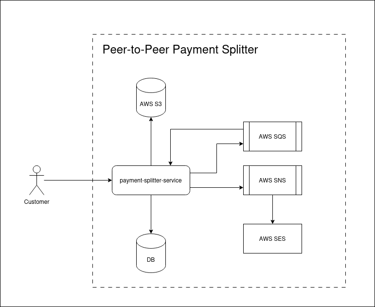
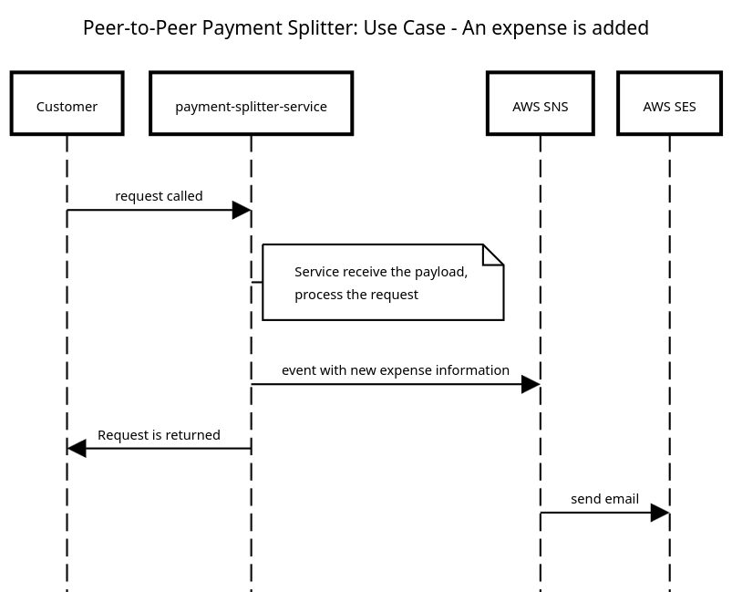
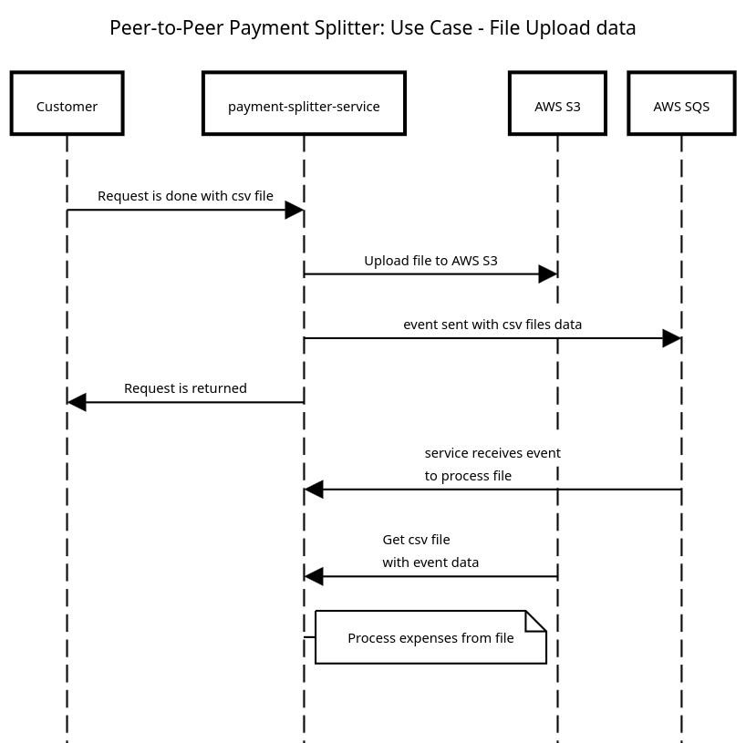

# Solution

A solução consiste na construção de um serviço principal chamado `payment-splitter-service`, que será o microserviço responsável em receber as requests e realizar os processamento das regras de negócio necessárias, além da utilização de alguns serviços da AWS como SQS, SNS, S3 e SES:

## Some use cases

To exemplify the flow and make it easier to understand, two happy path use cases were chosen to be mapped within a sequence diagram:

### Adding a new expense

### CSV file upload

## Limitations and Possibilities

The solution was designed based on the requirements presented in the `problem.md` file, so it is possible to notice some limitations and possibilities within this design:

- Requests are received directly by the `payment-splitter-service`
  - Protections (such as rate limit, authentication, authorization, etc.) that would need to be applied in this microservice could be moved to a new component (api-gateway or BFF - Backend For Frontend) that would act as middleware between the client/internet and the internal services
- Between the `payment-splitter-service` and the AWS SES service we could add a new service that would register these notifications and manage this information, in this way we could bring this information back to the user through a notification screen
- As the focus was on keeping the solution design more concise with a focus on solving the problem, file processing was also kept in the same microservice. With more information about the average use of this functionality and the number of records that may exist within this file, we can evaluate the creation of a new service (a new microservice or even a lambda) to read and process this data.

### Post-implementation comments

Unfortunately, it was not possible to complete the implementation of the solution, as I believe you already expected. However, it is still possible to indicate some paths related to the project:

1. For configuration, it would be interesting to add Husky to manager some git hooks.
2. Another work that I started, but decided to abort because it was taking too much time, is related to the project's observability (using Open Telemetry). Even though this was not added as a metric in the test, I understand it to be something very important and that every project in production should have. Therefore, I started the installation and configuration of Open Telemetry as a way to demonstrate my attention to this subject, but as said, I had to abort the idea.
3. I also used NestJs's native configuration to the log, without using any external lib. In an application that was going to production, this would also need to be changed with its output probably in JSON.
4. In the next activities related to AWS services, the e2e tests would probably be implemented with Localstack together with TestContainer.
5. To generate uuid I used the v4 version, because the configuration is easier, but I imagine that the v7 would be the best version to use
6. `yarn lint` brought necessary adjustments that due to time will not be made

The Json file to import into Postman is this `docs/Peer-to-Peer Payment Splitter.postman_collection.json`. If you prefer, I left the swagger configured in the endpoint http://localhost:3000/docs.
